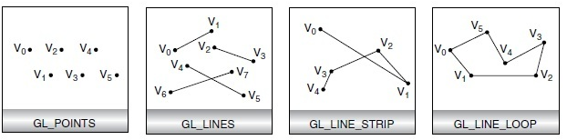
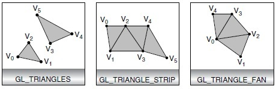

## C Specification

```glsl
void glDrawArrays(GLenum mode, GLint first, GLsizei count);
```

## Parameters

- **`mode`**

  *mode*

    需要渲染的图元类型，包括 GL_POINTS, GL_LINE_STRIP, GL_LINE_LOOP, GL_LINES, GL_TRIANGLE_STRIP, GL_TRIANGLE_FAN ，GL_TRIANGLES。

  - GL_POINTS：把每一个顶点作为一个点进行处理，顶点n即定义了点n，共绘制N个点
  - GL_LINES：连接每两个顶点作为一个独立的线段，顶点2n－1和2n之间共定义了n条线段，总共绘制N/2条线段
  - GL_LINE_STRIP：绘制从第一个顶点到最后一个顶点依次相连的一组线段，第n和n+1个顶点定义了线段n，总共绘制n－1条线段
  - GL_LINE_LOOP：绘制从第一个顶点到最后一个顶点依次相连的一组线段，然后最后一个顶点和第一个顶点相连，第n和n+1个顶点定义了线段n，总共绘制n条线段
  - GL_TRIANGLES：把每三个顶点作为一个独立的三角形，顶点3n－2、3n－1和3n定义了第n个三角形，总共绘制N/3个三角形
  - GL_TRIANGLE_STRIP：绘制一组相连的三角形，对于奇数n，顶点n、n+1和n+2定义了第n个三角形；对于偶数n，顶点n+1、n和n+2定义了第n个三角形，总共绘制N-2个三角形
  - GL_TRIANGLE_FAN：绘制一组相连的三角形，三角形是由第一个顶点及其后给定的顶点确定，顶点1、n+1和n+2定义了第n个三角形，总共绘制N-2个三角形

- **`first`**

  指定启用的数组的开始索引

- **`count`**

  指定用于渲染的索引数量




