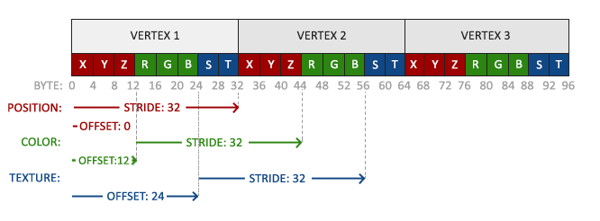

# 纹理

纹理坐标在x和y轴上，范围为0到1之间（注意我们使用的是2D纹理图像）。使用纹理坐标获取纹理颜色叫做采样(Sampling)。纹理坐标起始于(0, 0)，也就是纹理图片的左下角，终始于(1, 1)，即纹理图片的右上角。下面的图片展示了我们是如何把纹理坐标映射到三角形上的。


纹理坐标看起来就像这样：

```c
float texCoords[] = {
    0.0f, 0.0f, // 左下角
    1.0f, 0.0f, // 右下角
    0.5f, 1.0f // 上中
};
```

## 纹理环绕方式

| 环绕方式           | 描述                                                         |
| :----------------- | :----------------------------------------------------------- |
| GL_REPEAT          | 对纹理的默认行为。重复纹理图像。                             |
| GL_MIRRORED_REPEAT | 和GL_REPEAT一样，但每次重复图片是镜像放置的。                |
| GL_CLAMP_TO_EDGE   | 纹理坐标会被约束在0到1之间，超出的部分会重复纹理坐标的边缘，产生一种边缘被拉伸的效果。 |
| GL_CLAMP_TO_BORDER | 超出的坐标为用户指定的边缘颜色。                             |


使用glTexParameter*函数对单独的一个坐标轴设置（`s`、`t`（如果是使用3D纹理那么还有一个`r`）它们和`x`、`y`、`z`是等价的）：

```c
glTexParameteri(GL_TEXTURE_2D, GL_TEXTURE_WRAP_S, GL_MIRRORED_REPEAT);
glTexParameteri(GL_TEXTURE_2D, GL_TEXTURE_WRAP_T, GL_MIRRORED_REPEAT);
```

用GL_TEXTURE_BORDER_COLOR作为它的选项，并且传递一个float数组作为边缘的颜色值：

```c
float borderColor[] = { 1.0f, 1.0f, 0.0f, 1.0f };
glTexParameterfv(GL_TEXTURE_2D, GL_TEXTURE_BORDER_COLOR, borderColor);
```

## 纹理过滤

**GL_NEAREST**（也叫邻近过滤，Nearest Neighbor Filtering）是OpenGL默认的纹理过滤方式。当设置为GL_NEAREST的时候，OpenGL会选择中心点最接近纹理坐标的那个像素。下图中你可以看到四个像素，加号代表纹理坐标。左上角那个纹理像素的中心距离纹理坐标最近，所以它会被选择为样本颜色：


**GL_LINEAR**（也叫线性过滤，(Bi)linear Filtering）它会基于纹理坐标附近的纹理像素，计算出一个插值，近似出这些纹理像素之间的颜色。一个纹理像素的中心距离纹理坐标越近，那么这个纹理像素的颜色对最终的样本颜色的贡献越大。下图中你可以看到返回的颜色是邻近像素的混合色：


```c
glTexParameteri(GL_TEXTURE_2D, GL_TEXTURE_MIN_FILTER, GL_NEAREST);
glTexParameteri(GL_TEXTURE_2D, GL_TEXTURE_MAG_FILTER, GL_LINEAR);
```

**GL_TEXTURE_MIN_FILTER **: 纹理大于渲染屏幕，将会有一部分像素无法映射到屏幕上

**GL_TEXTURE_MAG_FILTER** : 纹理小于渲染屏幕，没有足够的像素映射到屏幕上


### 多级渐远纹理

**多级渐远纹理(Mipmap)**:是一系列的纹理图像，后一个纹理图像是前一个的二分之一。多级渐远纹理背后的理念很简单：距观察者的距离超过一定的阈值，OpenGL会使用不同的多级渐远纹理，即最适合物体的距离的那个。由于距离远，解析度不高也不会被用户注意到。同时，多级渐远纹理另一加分之处是它的性能非常好。让我们看一下多级渐远纹理是什么样子的：


glGenerateMipmaps函数，在创建完一个纹理后调用它OpenGL就会承担接下来的所有工作了。后面的教程中你会看到该如何使用它。

```c
glTexParameteri(GL_TEXTURE_2D, GL_TEXTURE_MIN_FILTER, GL_LINEAR_MIPMAP_LINEAR);
glTexParameteri(GL_TEXTURE_2D, GL_TEXTURE_MAG_FILTER, GL_LINEAR);
```

| 过滤方式                  | 描述                                                         |
| :------------------------ | :----------------------------------------------------------- |
| GL_NEAREST_MIPMAP_NEAREST | 使用最邻近的多级渐远纹理来匹配像素大小，并使用邻近插值进行纹理采样 |
| GL_LINEAR_MIPMAP_NEAREST  | 使用最邻近的多级渐远纹理级别，并使用线性插值进行采样         |
| GL_NEAREST_MIPMAP_LINEAR  | 在两个最匹配像素大小的多级渐远纹理之间进行线性插值，使用邻近插值进行采样 |
| GL_LINEAR_MIPMAP_LINEAR   | 在两个邻近的多级渐远纹理之间使用线性插值，并使用线性插值进行采样 |

# 加载与创建纹理

`stb_image.h`可以在[这里](https://github.com/nothings/stb/blob/master/stb_image.h)下载。将它以`stb_image.h`的名字加入你的工程，并另创建一个新的C++文件，输入以下代码：


```c
#define STB_IMAGE_IMPLEMENTATION
#include "stb_image.h"
```

通过定义**STB_IMAGE_IMPLEMENTATION**，预处理器会修改头文件，让其只包含相关的函数定义源码，等于是将这个头文件变为一个 `.cpp` 文件了。现在只需要在你的程序中包含`stb_image.h`并编译就可以了。

```c
unsigned int texture;
glGenTextures(1, &texture);
glBindTexture(GL_TEXTURE_2D, texture);
// 为当前绑定的纹理对象设置环绕、过滤方式
glTexParameteri(GL_TEXTURE_2D, GL_TEXTURE_WRAP_S, GL_REPEAT);   
glTexParameteri(GL_TEXTURE_2D, GL_TEXTURE_WRAP_T, GL_REPEAT);
glTexParameteri(GL_TEXTURE_2D, GL_TEXTURE_MIN_FILTER, GL_LINEAR);
glTexParameteri(GL_TEXTURE_2D, GL_TEXTURE_MAG_FILTER, GL_LINEAR);
// 加载并生成纹理
int width, height, nrChannels;
unsigned char *data = stbi_load("container.jpg", &width, &height, &nrChannels, 0);
if (data)
{
    glTexImage2D(GL_TEXTURE_2D, 0, GL_RGB, width, height, 0, GL_RGB, GL_UNSIGNED_BYTE, data);
    glGenerateMipmap(GL_TEXTURE_2D);
}
else
{
    std::cout << "Failed to load texture" << std::endl;
}
stbi_image_free(data);
```

纹理可以通过glTexImage2D来生成：

```c
glTexImage2D(GL_TEXTURE_2D, 0, GL_RGB, width, height, 0, GL_RGB, GL_UNSIGNED_BYTE, data);
```

我们逐个看参数：

- 第一个参数指定了纹理目标(Target)，设置为GL_TEXTURE_2D意味着会生成与当前绑定的纹理对象在同一个目标上的纹理（任何绑定到GL_TEXTURE_1D和GL_TEXTURE_3D的纹理不会受到影响）
- 第二个参数为纹理指定多级渐远纹理的级别（如果你希望单独手动设置每个多级渐远纹理的级别的话）这里我们填0，也就是基本级别
- 第三个参数告诉OpenGL我们希望把纹理储存为何种格式，我们的图像只有`RGB`值，因此我们也把纹理储存为`RGB`值
- 第四个和第五个参数设置最终的纹理的宽度和高度，我们之前加载图像的时候储存了它们，所以我们使用对应的变量
- 下个参数应该总是被设为`0`（历史遗留的问题）
- 第七第八个参数定义了源图的格式和数据类型。我们使用RGB值加载这个图像，并把它们储存为`char`(byte)数组，我们将会传入对应值
- 最后一个参数是真正的图像数据

## 应用纹理

后面的这部分我们会使用glDrawElements绘制[「你好，三角形」](https://learnopengl-cn.github.io/01 Getting started/04 Hello Triangle/)教程最后一部分的矩形。我们需要告知OpenGL如何采样纹理，所以我们必须使用纹理坐标更新顶点数据：

```c
float vertices[] = {
//     ---- 位置 ----       ---- 颜色 ----     - 纹理坐标 -
     0.5f,  0.5f, 0.0f,   1.0f, 0.0f, 0.0f,   1.0f, 1.0f,   // 右上
     0.5f, -0.5f, 0.0f,   0.0f, 1.0f, 0.0f,   1.0f, 0.0f,   // 右下
    -0.5f, -0.5f, 0.0f,   0.0f, 0.0f, 1.0f,   0.0f, 0.0f,   // 左下
    -0.5f,  0.5f, 0.0f,   1.0f, 1.0f, 0.0f,   0.0f, 1.0f    // 左上
};

glVertexAttribPointer(2, 2, GL_FLOAT, GL_FALSE, 8 * sizeof(float), (void*)(6 * sizeof(float)));
glEnableVertexAttribArray(2);
```



调整顶点着色器使其能够接受顶点坐标为一个顶点属性，并把坐标传给片段着色器：

```glsl
#version 330 core
layout (location = 0) in vec3 aPos;
layout (location = 1) in vec3 aColor;
layout (location = 2) in vec2 aTexCoord;

out vec3 ourColor;
out vec2 TexCoord;

void main()
{
    gl_Position = vec4(aPos, 1.0);
    ourColor = aColor;
    TexCoord = aTexCoord;
}
```

片段着色器也应该能访问纹理对象，但是我们怎样能把纹理对象传给片段着色器呢？GLSL有一个供纹理对象使用的内建数据类型，叫做采样器(Sampler)，它以纹理类型作为后缀，比如`sampler1D`、`sampler3D`，或在我们的例子中的`sampler2D`。我们可以简单声明一个`uniform sampler2D`把一个纹理添加到片段着色器中，稍后我们会把纹理赋值给这个uniform。

```glsl
#version 330 core
out vec4 FragColor;

in vec3 ourColor;
in vec2 TexCoord;

uniform sampler2D ourTexture;

void main()
{
    FragColor = texture(ourTexture, TexCoord);
}
```

现在只剩下在调用glDrawElements之前绑定纹理了，它会自动把纹理赋值给片段着色器的采样器：

```c
glBindTexture(GL_TEXTURE_2D, texture);
glBindVertexArray(VAO);
glDrawElements(GL_TRIANGLES, 6, GL_UNSIGNED_INT, 0);
```

## 纹理单元

你可能会奇怪为什么`sampler2D`变量是个uniform，我们却不用glUniform给它赋值。使用glUniform1i，我们可以给纹理采样器分配一个**位置值**，这样的话我们能够在一个片段着色器中设置多个纹理。一个**纹理的位置值**通常称为一个**纹理单元(Texture Unit)**。一个纹理的默认纹理单元是0，它是默认的激活纹理单元，所以教程前面部分我们没有分配一个位置值。

纹理单元的主要目的是让我们在着色器中可以使用多个的纹理，通过把纹理单元赋值给采样器，只要我们首先激活对应的纹理单元，我们可以一次绑定多个纹理

就像glBindTexture一样，我们可以使用glActiveTexture激活纹理单元，传入我们需要使用的纹理单元：

```c
glActiveTexture(GL_TEXTURE0); // 在绑定纹理之前先激活纹理单元
glBindTexture(GL_TEXTURE_2D, texture);
```


## 参考资料

[OPENGL管理TEXTURE参数的函数总结](https://www.cnblogs.com/mooniscrazy/p/13594743.html)

[OpenGL ES 纹理过滤模式-glTexParameteri](https://zhuanlan.zhihu.com/p/103881133)

[anisotropy texture filtering](https://www.cnblogs.com/kylegui/p/3855710.html)

[glActiveTexture和glBindTexture的区别和联系](https://blog.csdn.net/artisans/article/details/76695614)

