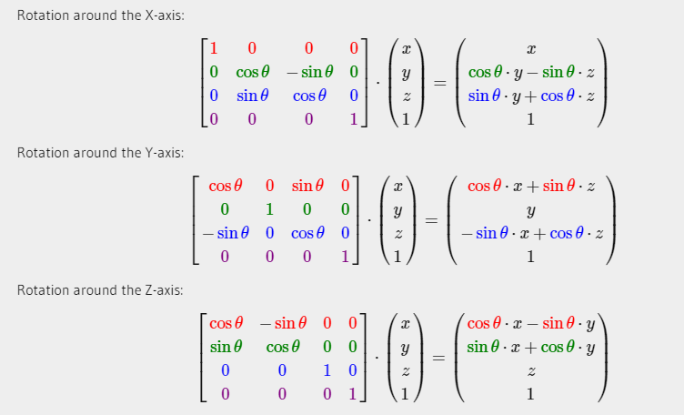

# 矩阵

矩阵中每一项叫做矩阵的元素(Element)。下面是一个2×3矩阵的例子：
$$
\left[ \begin{matrix}a&b&c\\x&y&z\end{matrix} \right]
$$
矩阵可以通过(i, j)进行索引，i是行，j是列，这就是上面的矩阵叫做2×3矩阵的原因（3列2行，也叫做矩阵的维度(Dimension)）。这与你在索引2D图像时的(x, y)相反，获取4的索引是(2, 1)（第二行，第一列）（译注：如果是图像索引应该是(1, 2)，先算列，再算行）。

## 矩阵的加减

## 矩阵的数乘

## 矩阵相乘

矩阵之间的乘法不见得有多复杂，但的确很难让人适应。矩阵乘法基本上意味着遵照规定好的法则进行相乘。当然，相乘还有一些限制：

1. 只有当左侧矩阵的列数与右侧矩阵的行数相等，两个矩阵才能相乘。
2. 矩阵相乘不遵守交换律(Commutative)，也就是说 **A⋅B≠B⋅A**

# 矩阵与向量相乘

## 单位矩阵

在OpenGL中，由于某些原因我们通常使用**4×4**的变换矩阵，而其中最重要的原因就是大部分的向量都是4分量的。我们能想到的最简单的变换矩阵就是单位矩阵(Identity Matrix)。单位矩阵是一个除了对角线以外都是0的**N×N**矩阵。在下式中可以看到，这种变换矩阵使一个向量完全不变：

## 缩放

我们先来尝试缩放向量*v=(3,2)*。我们可以把向量沿着x轴缩放0.5，使它的宽度缩小为原来的二分之一；我们将沿着y轴把向量的高度缩放为原来的两倍。我们看看把向量缩放(0.5, 2)倍所获得的*s*是什么样的：

记住，OpenGL通常是在3D空间进行操作的，对于2D的情况我们可以把z轴缩放1倍，这样z轴的值就不变了。我们刚刚的缩放操作是不均匀(Non-uniform)缩放，因为每个轴的缩放因子(Scaling Factor)都不一样。如果每个轴的缩放因子都一样那么就叫均匀缩放(Uniform Scale)。

## 位移

位移(Translation)是在原始向量的基础上加上另一个向量从而获得一个在不同位置的新向量的过程，从而在位移向量基础上**移动**了原始向量。我们已经讨论了向量加法，所以这应该不会太陌生。

## 旋转

## 矩阵的组合

使用矩阵进行变换的真正力量在于，根据矩阵之间的乘法，我们可以把多个变换组合到一个矩阵中。让我们看看我们是否能生成一个变换矩阵，让它组合多个变换。假设我们有一个顶点(x, y, z)，我们希望将其缩放2倍，然后位移(1, 2, 3)个单位。我们需要一个位移和缩放矩阵来完成这些变换。结果的变换矩阵看起来像这样：

注意，当矩阵相乘时我们**先写位移再写缩放变换**的，**矩阵乘法不遵守交换律**，这意味着它们的顺序很重要。当矩阵相乘时，在最右边的矩阵是第一个与向量相乘的，所以你应该**从右向左读这个乘法**，建议在组合矩阵时，先进行缩放操作，然后是旋转，最后才是位移，否则会互相影响