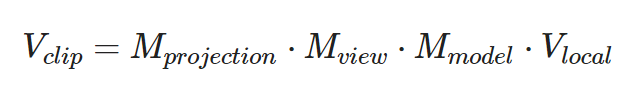

# 坐标系统

OpenGL希望在每次顶点着色器运行后，我们可见的所有顶点都为标准化设备坐标(Normalized Device Coordinate, NDC)。也就是说，每个顶点的**x**，**y**，**z**坐标都应该在**-1.0**到**1.0**之间，超出这个坐标范围的顶点都将不可见。

比较重要的总共有5个不同的坐标系统：

- 局部空间(Local Space，或者称为物体空间(Object Space))
- 世界空间(World Space)
- 观察空间(View Space，或者称为视觉空间(Eye Space))
- 裁剪空间(Clip Space)
- 屏幕空间(Screen Space)

## 概述

为了将坐标从一个坐标系变换到另一个坐标系，我们需要用到几个变换矩阵，最重要的几个分别是**模型(Model)**、**观察(View)**、**投影(Projection)**三个矩阵。我们的顶点坐标起始于**局部空间(Local Space)**，在这里它称为局部坐标(Local Coordinate)，它在之后会变为**世界坐标(World Coordinate)**，**观察坐标(View Coordinate)**，**裁剪坐标(Clip Coordinate)**，并最后以屏幕坐标(Screen Coordinate)的形式结束。下面的这张图展示了整个流程以及各个变换过程做了什么：


1. 局部坐标是对象相对于局部原点的坐标，也是物体起始的坐标。
2. 下一步是将局部坐标变换为世界空间坐标，世界空间坐标是处于一个更大的空间范围的。这些坐标相对于世界的全局原点，它们会和其它物体一起相对于世界的原点进行摆放。
3. 接下来我们将世界坐标变换为观察空间坐标，使得每个坐标都是从摄像机或者说观察者的角度进行观察的。
4. 坐标到达观察空间之后，我们需要将其投影到裁剪坐标。裁剪坐标会被处理至-1.0到1.0的范围内，并判断哪些顶点将会出现在屏幕上。
5. 最后，我们将裁剪坐标变换为屏幕坐标，我们将使用一个叫做**视口变换(Viewport Transform)**的过程。视口变换将位于-1.0到1.0范围的坐标变换到由glViewport函数所定义的坐标范围内。最后变换出来的坐标将会送到光栅器，将其转化为片段。

## 局部空间

局部空间是指物体所在的坐标空间，即对象最开始所在的地方。模型的所有顶点都是在**局部**空间中：它们相对于你的物体来说都是局部的。

## 世界空间

世界空间中的坐标正如其名：是指顶点相对于（游戏）世界的坐标。如果你希望将物体分散在世界上摆放（特别是非常真实的那样），这就是你希望物体变换到的空间。物体的坐标将会从局部变换到世界空间；该变换是由模型矩阵(Model Matrix)实现的。

## 观察空间

观察坐标是**以摄像机为坐标原点，摄像机的朝向为Z轴方向的坐标**系

我们在窗口里看到的东西都是摄像机帮我们看的（因此也称为摄像机空间(Camera Space)或视觉空间(Eye Space)），所以观察空间就是从摄像机的视角所观察到的空间

*在局部，世界，观察空间下，X,Y,Z的范围都是无穷大，只是坐标系的基准不一样而已*

观察坐标也是由一系列的位移和旋转的组合来完成——平移/旋转场景从而使得特定的对象被变换到摄像机的前方，这些组合在一起的变换存储在另一个变换矩阵——**观察矩阵(View Matrix)**里，它用来将世界坐标变换到观察空间

## 裁剪空间

在一个顶点着色器运行的最后，OpenGL期望所有的坐标都能落在一个特定的范围内，且任何在这个范围之外的点都应该被裁**剪掉(Clipped)**。被裁剪掉的坐标就会被忽略，所以剩下的坐标就将变为屏幕上可见的片段。这也就是**裁剪空间(Clip Space)**名字的由来。

为了将顶点坐标从观察变换到裁剪空间，我们需要定义一个**投影矩阵(Projection Matrix)**，它指定了一个范围的坐标，比如在每个维度上的-1000到1000。投影矩阵接着会将在这个指定的范围内的坐标变换为标准化设备坐标的范围(-1.0, 1.0)。

由投影矩阵创建的**观察箱**(Viewing Box)被称为**平截头体(Frustum)**，每个出现在平截头体范围内的坐标都会最终出现在用户的屏幕上，将特定范围内的坐标转化到标准化设备坐标系的过程被称之为**投影(Projection)**，因为使用投影矩阵能将3D坐标投影(Project)到很容易映射到2D的标准化设备坐标系中

一旦所有顶点被变换到裁剪空间，最终的操作——**透视除法(Perspective Division)**将会执行，在这个过程中我们将位置向量的x，y，z分量分别除以向量的齐次w分量；透视除法是将4D裁剪空间坐标变换为3D标准化设备坐标的过程，这一步会在每一个顶点着色器运行的最后被自动执行

将观察坐标变换为裁剪坐标的投影矩阵可以为两种不同的形式，每种形式都定义了不同的平截头体。我们可以选择创建一个**正射投影矩阵(Orthographic Projection Matrix)**或一个**透视投影矩阵(Perspective Projection Matrix)**

### 正射投影

正射投影矩阵定义了一个类似立方体的平截头箱，它定义了一个裁剪空间，在这空间之外的顶点都会被裁剪掉。创建一个正射投影矩阵需要指定可见平截头体的宽、高和长度。在使用正射投影矩阵变换至裁剪空间之后处于这个平截头体内的所有坐标将不会被裁剪掉。它的平截头体看起来像一个容器：


上面的平截头体定义了可见的坐标，它由由宽、高、近(Near)平面和远(Far)平面所指定。任何出现在近平面之前或远平面之后的坐标都会被裁剪掉。正射平截头体直接将平截头体内部的所有坐标映射为标准化设备坐标，因为每个向量的w分量都没有进行改变；如果w分量等于1.0，透视除法则不会改变这个坐标。

要创建一个正射投影矩阵，我们可以使用GLM的内置函数`glm::ortho`：

```c
glm::ortho(0.0f, 800.0f, 0.0f, 600.0f, 0.1f, 100.0f);
```

前两个参数指定了平截头体的左右坐标，第三和第四参数指定了平截头体的底部和顶部。通过这四个参数我们定义了近平面和远平面的大小，然后第五和第六个参数则定义了近平面和远平面的距离。这个投影矩阵会将处于这些x，y，z值范围内的坐标变换为标准化设备坐标。

### 透视投影

离你越远的东西看起来更小,效果称之为透视(Perspective)。使用透视投影矩阵来完成


这个投影矩阵将给定的平截头体范围映射到裁剪空间，除此之外还修改了**每个顶点坐标的w值**，从而使得**离观察者越远的顶点坐标w分量越大**，被变换到裁剪空间的坐标都会在-w到w的范围之间（任何大于这个范围的坐标都会被裁剪掉），OpenGL要求所有可见的坐标都落在-1.0到1.0范围内，作为顶点着色器最后的输出，因此，一旦坐标在裁剪空间内之后，透视除法就会被应用到裁剪空间坐标上：


在GLM中可以这样创建一个透视投影矩阵：

```c
glm::mat4 proj = glm::perspective(
    glm::radians(45.0f), 		//FOV
    (float)width/(float)height, //宽高比
    0.1f, 						//平截头体的近面
    100.0f						//平截头体的远面
);
```

同样，`glm::perspective`所做的其实就是创建了一个定义了可视空间的大**平截头体**

1. 第一个参数定义了fov的值，它表示的是视野(Field of View)，并且设置了观察空间的大小（如果想要一个真实的观察效果，它的值通常设置为45.0f，但想要一个末日风格的结果你可以将其设置一个更大的值）
2. 第二个参数设置了宽高比，由视口的宽除以高所得
3. 第三和第四个参数设置了平截头体的**近**和**远**平面，我们通常设置近距离为0.1f，而远距离设为100.0f


## 空间组合

我们为上述的每一个步骤都创建了一个变换矩阵：**模型矩阵**、**观察矩阵**和**投影矩阵**，一个顶点坐标将会根据以下过程被变换到裁剪坐标：



顶点着色器的输出要求所有的顶点都在裁剪空间内，这正是我们刚才使用变换矩阵所做的。OpenGL然后对**裁剪坐标**执行**透视除法**从而将它们变换到**标准化设备坐标**。OpenGL会使用glViewPort内部的参数来将标准化设备坐标映射到**屏幕坐标**，每个坐标都关联了一个屏幕上的点（在我们的例子中是一个800x600的屏幕）。这个过程称为视口变换。

## 应用到3D

#### 模型矩阵

在开始进行3D绘图时，我们首先创建一个模型矩阵，这个模型矩阵包含了位移、缩放与旋转操作，它们会被应用到所有物体的顶点上，以变换它们到全局的世界空间

#### 观察矩阵

我们以相反于摄像机移动的方向移动整个场景。因为我们想要往后移动，并且OpenGL是一个右手坐标系(Right-handed System)，所以我们需要沿着z轴的正方向移动，我们会通过将场景沿着z轴负方向平移来实现，它会给我们一种我们在往后移动的感觉

**OpenGL是一个右手坐标系**，简单来说，就是正x轴在你的右手边，正y轴朝上，而正z轴是朝向后方的。想象你的屏幕处于三个轴的中心，则正z轴穿过你的屏幕朝向你。坐标系画起来如下：


#### 投影矩阵

创建投影矩阵

```c
glm::mat4 projection;
projection = glm::perspective(glm::radians(45.0f), screenWidth / screenHeight, 0.1f, 100.0f);
```

在shader中使用

```glsl
// vertex shader
#version 330 core
layout (location = 0) in vec3 aPos;
layout (location = 1) in vec2 aTexCoord;

out vec2 TexCoord;

uniform mat4 model;
uniform mat4 view;
uniform mat4 projection;

void main()
{
    // 注意乘法要从右向左读
    gl_Position = projection * view * model * vec4(aPos, 1.0);
	TexCoord = vec2(aTexCoord.x, aTexCoord.y);
}
```

将矩阵传入着色器

```c
// 观察矩阵和投影矩阵与之类似
int modelLoc = glGetUniformLocation(ourShader.ID, "model"));
glUniformMatrix4fv(modelLoc, 1, GL_FALSE, glm::value_ptr(model));

// shader类里加入setMat4的方法
void setMat4(const std::string &name, const glm::mat4 &mat) const
{
    glUniformMatrix4fv(glGetUniformLocation(ID, name.c_str()), 1, GL_FALSE, &mat[0][0]);
}
```

最终效果

```c
// 创建矩阵
glm::mat4 model = glm::mat4(1.0f);
glm::mat4 view = glm::mat4(1.0f);
glm::mat4 projection = glm::mat4(1.0f);
model = glm::rotate(model, glm::radians(-55.0f), glm::vec3(1.0f, 0.0f, 0.0f));
view = glm::translate(view, glm::vec3(0.0f, 0.0f, -3.0f));
projection = glm::perspective(glm::radians(45.0f), (float)SCR_WIDTH / (float)SCR_HEIGHT, 0.1f, 100.0f);
// 将矩阵传入着色器
ourShader.setMat4("model", model);
ourShader.setMat4("view", view);
ourShader.setMat4("projection", projection);
```

### Z缓冲

OpenGL存储它的所有深度信息于一个**Z缓冲(Z-buffer)**中，也被称为**深度缓冲(Depth Buffer)**。GLFW会自动为你生成这样一个缓冲（就像它也有一个颜色缓冲来存储输出图像的颜色）。深度值存储在每个片段里面（作为片段的**z**值），当片段想要输出它的颜色时，OpenGL会将它的深度值和z缓冲进行比较，如果当前的片段在其它片段之后，它将会被丢弃，否则将会覆盖。这个过程称为深度测试(Depth Testing)，它是由OpenGL自动完成的。**glEnable**和**glDisable**函数允许我们启用或禁用某个OpenGL功能。

```c
//启用深度测试
glEnable(GL_DEPTH_TEST);
//每次渲染迭代之前清除深度缓冲，清除颜色缓冲和深度缓冲
glClear(GL_COLOR_BUFFER_BIT | GL_DEPTH_BUFFER_BIT);
```

