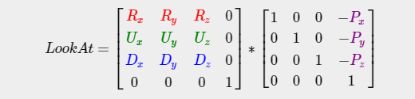

# 摄像机

## 摄像机/观察空间

观察矩阵把所有的世界坐标变换为相对于摄像机位置与方向的观察坐标。要定义一个摄像机，我们需要它在世界空间中的位置、观察的方向、一个指向它右测的向量以及一个指向它上方的向量。


### 1. 摄像机位置

正z轴是从屏幕指向你的，如果我们希望摄像机向后移动，我们就沿着z轴的正方向移动。

```c
glm::vec3 cameraPos = glm::vec3(0.0f, 0.0f, 3.0f);
```


### 2. 摄像机方向

用场景原点向量减去摄像机位置向量的结果就是摄像机的指向向量。由于我们知道**摄像机指向z轴负方向**，但我们希望方向向量(Direction Vector)指向摄像机的z轴正方向。交换相减的顺序，我们就会获得一个指向摄像机正z轴方向的向量：

```c
glm::vec3 cameraTarget = glm::vec3(0.0f, 0.0f, 0.0f);
glm::vec3 cameraDirection = glm::normalize(cameraPos - cameraTarget);
```

### 3. 右轴

我们需要的另一个向量是一个**右向量**(Right Vector)，它代表摄像机空间的x轴的正方向。为获取右向量我们需要先使用一个小技巧：先定义一个**上向量**(Up Vector)。接下来把上向量和第二步得到的方向向量进行叉乘。两个向量叉乘的结果会同时垂直于两向量，因此我们会得到指向x轴正方向的那个向量（如果我们交换两个向量叉乘的顺序就会得到相反的指向x轴负方向的向量）：

```c
glm::vec3 up = glm::vec3(0.0f, 1.0f, 0.0f); 
glm::vec3 cameraRight = glm::normalize(glm::cross(up, cameraDirection));
```

### 4. 上轴

现在我们已经有了x轴向量和z轴向量，获取一个指向摄像机的正y轴向量就相对简单了：我们把右向量和方向向量进行叉乘：

```c
glm::vec3 cameraUp = glm::cross(cameraDirection, cameraRight);
```

## Look At



R是右向量，U是上向量，D是方向向量，P是摄像机位置向量（位置向量是相反的，因为我们最终希望把世界平移到与我们自身移动的相反方向）

GLM已经提供了这些支持，我们要做的只是定义**一个摄像机位置**，**一个目标位置**和**一个表示世界空间中的上向量的向量**（我们计算右向量使用的那个上向量），GLM就会创建一个LookAt矩阵，我们可以把它当作我们的观察矩阵：

```c
glm::mat4 view;
view = glm::lookAt(glm::vec3(0.0f, 0.0f, 3.0f), 
           		   glm::vec3(0.0f, 0.0f, 0.0f), 
          	 	   glm::vec3(0.0f, 1.0f, 0.0f));
```

# 视角移动

## 欧拉角

欧拉角(Euler Angle)是可以表示3D空间中任何旋转的3个值，由莱昂哈德·欧拉(Leonhard Euler)在18世纪提出。一共有3种欧拉角：俯仰角(Pitch)、偏航角(Yaw)和滚转角(Roll)，下面的图片展示了它们的含义：


俯仰角是描述我们如何往上或往下看的角，可以在第一张图中看到。第二张图展示了偏航角，偏航角表示我们往左和往右看的程度。滚转角代表我们如何**翻滚**摄像机，通常在太空飞船的摄像机中使用。每个欧拉角都有一个值来表示，把三个角结合起来我们就能够计算3D空间中任何的旋转向量了。
