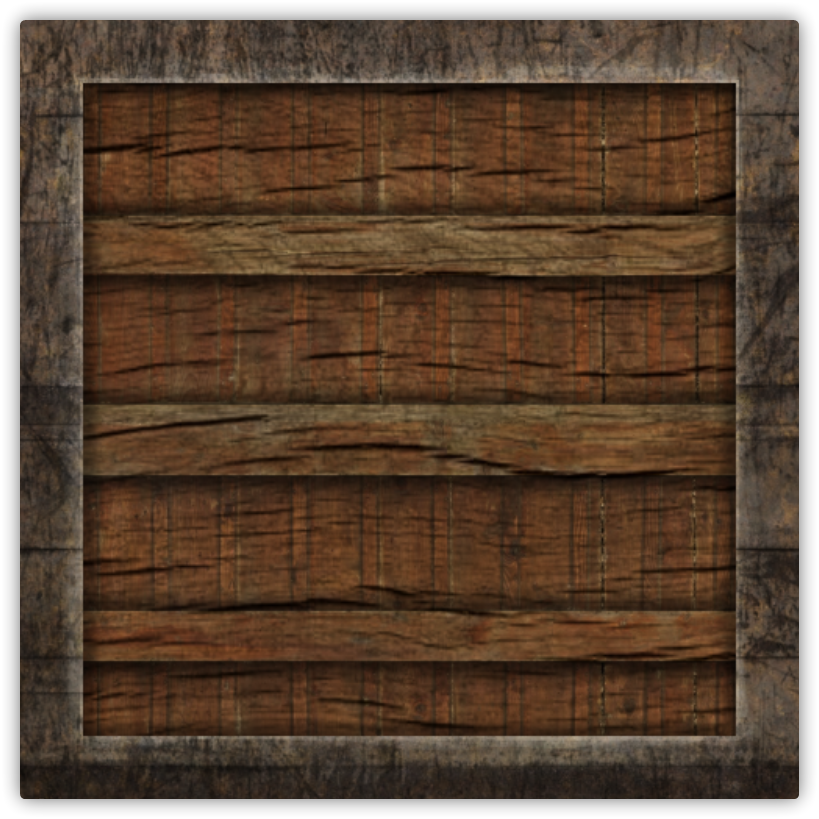
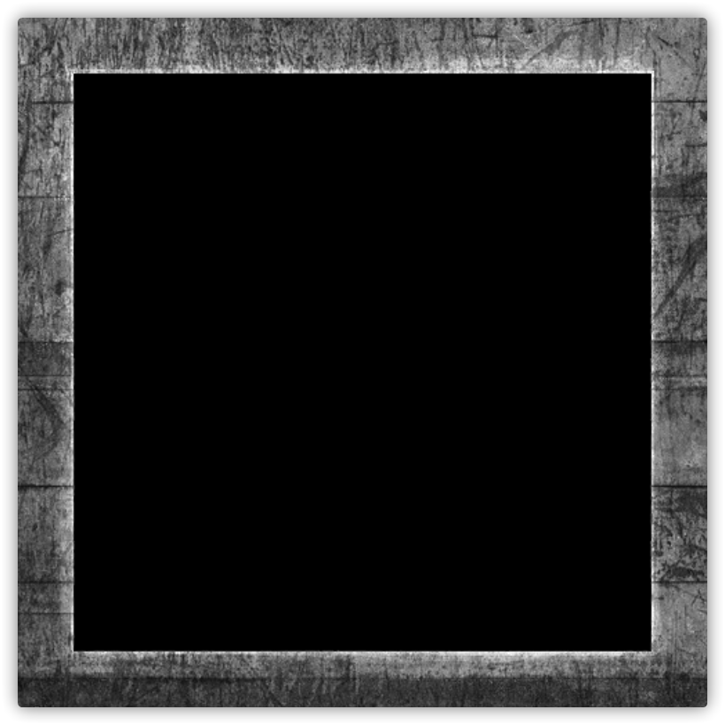

# 光照贴图

**漫反射**和**镜面光贴图(Map)**，这允许我们对物体的漫反射分量（以及间接地对环境光分量，它们几乎总是一样的）和镜面光分量有着更精确的控制

# 漫反射贴图

纹理和贴图其实都是使用一张覆盖物体的图像，让我们能够逐片段索引其独立的颜色值，在光照场景中，它通常叫做一个**漫反射贴图(Diffuse Map)**，它是一个表现了物体所有的漫反射颜色的纹理图像

为了演示漫反射贴图，我们将会使用[这张图片](https://img2018.cnblogs.com/blog/1536438/201908/1536438-20190816120441694-889876487.png)，它是一个有钢边框的木箱：



在着色器中使用漫反射贴图的方法和纹理教程中是完全一样的，但这次我们会将纹理储存为Material结构体中的一个`sampler2D`，我们将之前定义的`vec3`漫反射颜色向量替换为漫反射贴图。我们也移除了环境光材质颜色向量，因为环境光颜色在几乎所有情况下都等于漫反射颜色，所以我们不需要将它们分开储存：

```glsl
struct Material {
    sampler2D diffuse;
    vec3      specular;
    float     shininess;
}; 
...
in vec2 TexCoords;
```

```glsl
vec3 diffuse = light.diffuse * diff * vec3(texture(material.diffuse, TexCoords));
vec3 ambient = light.ambient * vec3(texture(material.diffuse, TexCoords));
```

# 镜面光贴图

你可能会注意到，镜面高光看起来有些奇怪，因为我们的物体大部分都是木头，我们知道木头不应该有这么强的镜面高光的，我们可以将物体的镜面光材质设置为`vec3(0.0)`来解决这个问题，但这也意味着箱子钢制的边框将不再能够显示镜面高光了，钢铁应该是有一些镜面高光的



镜面高光的强度可以通过图像每个像素的亮度来获取，镜面光贴图上的每个像素都可以由一个颜色向量来表示，比如说黑色代表颜色向量`vec3(0.0)`，灰色代表颜色向量`vec3(0.5)`，在片段着色器中，我们接下来会取样对应的颜色值并将它乘以光源的镜面强度，一个像素越「白」，乘积就会越大，物体的镜面光分量就会越亮。

接下来更新片段着色器的材质属性，让其接受一个`sampler2D`而不是`vec3`作为镜面光分量：

```glsl
struct Material {
    sampler2D diffuse;
    sampler2D specular;
    float     shininess;
};

vec3 specular = light.specular * spec * vec3(texture(material.specular, TexCoords));
```

