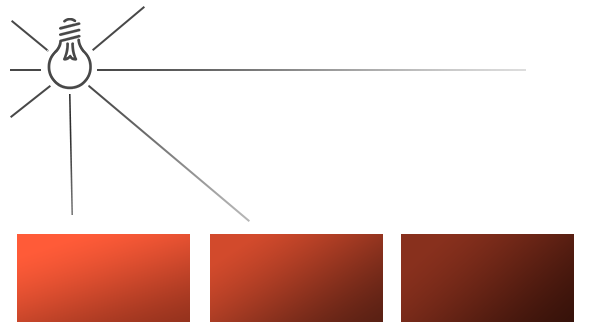
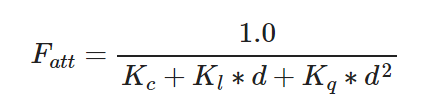

# 投光物

## 平行光

当一个光源处于很远的地方时，来自光源的每条光线就会近似于互相平行。不论物体和/或者观察者的位置，看起来好像所有的光都来自于同一个方向。当我们使用一个假设光源处于**无限**远处的模型时，它就被称为定向光，因为它的所有光线都有着相同的方向，它与光源的位置是没有关系的。


我们可以定义一个光线方向向量而不是位置向量来模拟一个定向光。着色器的计算基本保持不变，但这次我们将直接使用光的direction向量而不是通过direction来计算lightDir向量。

```glsl
struct Light {
    // vec3 position; // 使用定向光就不再需要了
    vec3 direction;

    vec3 ambient;
    vec3 diffuse;
    vec3 specular;
};
...
void main()
{
  vec3 lightDir = normalize(-light.direction);
  ...
}
```

注意我们首先对light.direction向量取反。我们目前使用的光照计算需求一个从片段**至**光源的光线方向，但人们更习惯定义定向光为一个**从**光源出发的全局方向。所以我们需要对全局光照方向向量取反来改变它的方向，它现在是一个指向光源的方向向量了。而且，记得对向量进行标准化，假设输入向量为一个单位向量是很不明智的。


我们一直将光的位置和位置向量定义为`vec3`，但一些人会喜欢将所有的向量都定义为`vec4`。当我们将位置向量定义为一个`vec4`时，很重要的一点是要将w分量设置为1.0，这样变换和投影才能正确应用。然而，当我们定义一个方向向量为`vec4`的时候，我们不想让位移有任何的效果（因为它仅仅代表的是方向），所以我们将w分量设置为0.0。

方向向量就会像这样来表示：`vec4(0.2f, 1.0f, 0.3f, 0.0f)`。这也可以作为一个快速检测光照类型的工具：你可以检测w分量是否等于1.0，来检测它是否是光的位置向量；w分量等于0.0，则它是光的方向向量，这样就能根据这个来调整光照计算了：

```
if(lightVector.w == 0.0) // 注意浮点数据类型的误差
  // 执行定向光照计算
else if(lightVector.w == 1.0)
  // 根据光源的位置做光照计算（与上一节一样）
```

你知道吗：这正是旧OpenGL（固定函数式）决定光源是定向光还是位置光源(Positional Light Source)的方法，并根据它来调整光照。

## 点光源

定向光对于照亮整个场景的全局光源是非常棒的，但除了定向光之外我们也需要一些分散在场景中的点光源(Point Light)。点光源是处于世界中某一个位置的光源，它会朝着所有方向发光，但光线会随着距离逐渐衰减。想象作为投光物的灯泡和火把，它们都是点光源。



### 衰减



在这里d代表了片段距光源的距离，接下来为了计算衰减值，我们定义3个可配置项：
常数项Kc、一次项Kl和二次项Kq

- **常数项Kc**通常保持为1.0，它的主要作用是保证分母永远不会比1小，否则的话在某些距离上它反而会增加强度，这肯定不是我们想要的效果
- **一次项Kl**会与距离值相乘，以线性的方式减少强度
- **二次项Kq**会与距离的平方相乘，让光源以二次递减的方式减少强度，二次项在距离比较小的时候影响会比一次项小很多，但当距离值比较大的时候它就会比一次项更大了


### 实现衰减

为了实现衰减，在片段着色器中我们还需要三个额外的值：也就是公式中的常数项、一次项和二次项。

```glsl
struct Light {
    vec3 position;  

    vec3 ambient;
    vec3 diffuse;
    vec3 specular;

    float constant;
    float linear;
    float quadratic;
};


float distance    = length(light.position - FragPos);
float attenuation = 1.0 / (light.constant + light.linear * distance + 
                light.quadratic * (distance * distance));


ambient  *= attenuation; 
diffuse  *= attenuation;
specular *= attenuation;
```

## 聚光

OpenGL中聚光是用**一个世界空间位置、一个方向和一个切光角(Cutoff Angle)**来表示的，切光角指定了聚光的半径（是圆锥的半径），对于每个片段，我们会计算片段是否位于聚光的切光方向之间（也就是在锥形内），如果是的话，我们就会相应地照亮片段


- `LightDir`：从片段指向光源的向量
- `SpotDir`：聚光所指向的方向
- `Phiϕ`：指定了聚光半径的切光角，落在这个角度之外的物体都不会被这个聚光所照亮。
- `Thetaθ`：LightDir向量和SpotDir向量之间的夹角，在聚光内部的话`θ`值应该比`ϕ`值小

所以我们要做的就是计算LightDir向量和SpotDir向量之间的点积（返回两个单位向量夹角的余弦值），并将它与切光角ϕ值对比

你现在应该了解聚光究竟是什么了，下面我们将以手电筒的形式创建一个聚光

```glsl
//片段着色器
struct Light {
    vec3  position;
    vec3  direction;
    float cutOff;
    ...
};

lightingShader.setVec3("light.position",  camera.Position);
lightingShader.setVec3("light.direction", camera.Front);
lightingShader.setFloat("light.cutOff",   glm::cos(glm::radians(12.5f)));

float theta = dot(lightDir, normalize(-light.direction));

if(theta > light.cutOff) 
{       
  // 执行光照计算
}
else  // 否则，使用环境光，让场景在聚光之外时不至于完全黑暗
	color = vec4(light.ambient * vec3(texture(material.diffuse, TexCoords)), 1.0);
```

