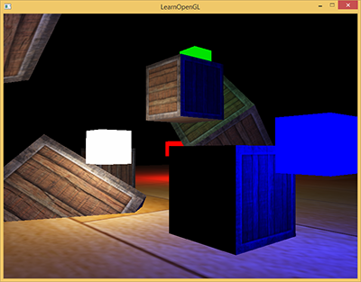
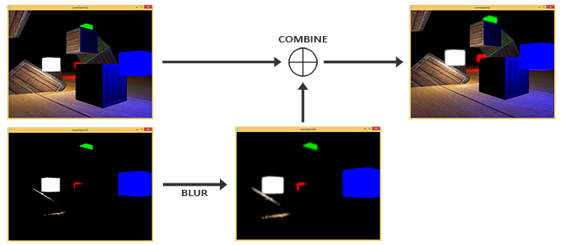
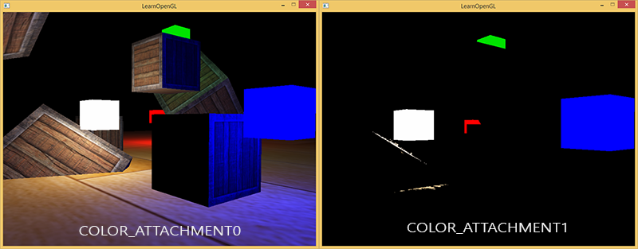
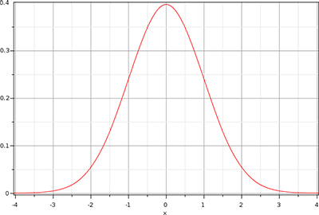

# 泛光

明亮的光源和区域经常很难向观察者表达出来，因为监视器的亮度范围是有限的。一种区分明亮光源的方式是使它们在监视器上发出光芒，光源的光芒向四周发散。这样观察者就会产生光源或亮区的确是强光区。（译注：这个问题的提出简单来说是为了解决这样的问题：例如有一张在阳光下的白纸，白纸在监视器上显示出是出白色，而前方的太阳也是纯白色的，所以基本上白纸和太阳就是一样的了，给太阳加一个光晕，这样太阳看起来似乎就比白纸更亮了）

光晕效果可以使用一个后处理特效泛光来实现。泛光使所有明亮区域产生光晕效果。下面是一个使用了和没有使用光晕的对比（图片生成自虚幻引擎）：


Bloom是我们能够注意到一个明亮的物体真的有种明亮的感觉。泛光可以极大提升场景中的光照效果，并提供了极大的效果提升，尽管做到这一切只需一点改变。

Bloom和HDR结合使用效果很好。常见的一个误解是HDR和泛光是一样的，很多人认为两种技术是可以互换的。但是它们是两种不同的技术，用于各自不同的目的上。可以使用默认的8位精确度的帧缓冲，也可以在不使用泛光效果的时候，使用HDR。只不过在有了HDR之后再实现泛光就更简单了。

为实现泛光，我们像平时那样渲染一个有光场景，提取出场景的HDR颜色缓冲以及只有这个场景明亮区域可见的图片。被提取的带有亮度的图片接着被模糊，结果被添加到HDR场景上面。

我们来一步一步解释这个处理过程。我们在场景中渲染一个带有4个立方体形式不同颜色的明亮的光源。带有颜色的发光立方体的亮度在1.5到15.0之间。如果我们将其渲染至HDR颜色缓冲，场景看起来会是这样的：



我们得到这个HDR颜色缓冲纹理，提取所有超出一定亮度的fragment。这样我们就会获得一个只有fragment超过了一定阈限的颜色区域：


我们将这个超过一定亮度阈限的纹理进行模糊。泛光效果的强度很大程度上是由被模糊过滤器的范围和强度所决定。


最终的被模糊化的纹理就是我们用来获得发出光晕效果的东西。这个已模糊的纹理要添加到原来的HDR场景纹理之上。因为模糊过滤器的应用明亮区域发出光晕，所以明亮区域在长和宽上都有所扩展。


泛光本身并不是个复杂的技术，但很难获得正确的效果。它的品质很大程度上取决于所用的模糊过滤器的质量和类型。简单地改改模糊过滤器就会极大的改变泛光效果的品质。

下面这几步就是泛光后处理特效的过程，它总结了实现泛光所需的步骤。



首先我们需要根据一定的阈限提取所有明亮的颜色。我们先来做这件事。

## 提取亮色

第一步我们要从渲染出来的场景中提取两张图片。我们可以渲染场景两次，每次使用一个不同的着色器渲染到不同的帧缓冲中，但我们可以使用一个叫做MRT（Multiple Render Targets，多渲染目标）的小技巧，这样我们就能指定多个像素着色器输出；有了它我们还能够在一个单独渲染处理中提取头两个图片。在像素着色器的输出前，我们指定一个布局location标识符，这样我们便可控制一个像素着色器写入到哪个颜色缓冲：

```
layout (location = 0) out vec4 FragColor;
layout (location = 1) out vec4 BrightColor;
```

只有我们真的具有多个地方可写的时候这才能工作。使用多个像素着色器输出的必要条件是，有多个颜色缓冲附加到了当前绑定的帧缓冲对象上。你可能从帧缓冲教程那里回忆起，当把一个纹理链接到帧缓冲的颜色缓冲上时，我们可以指定一个颜色附件。直到现在，我们一直使用着GL_COLOR_ATTACHMENT0，但通过使用GL_COLOR_ATTACHMENT1，我们可以得到一个附加了两个颜色缓冲的帧缓冲对象：

```
// Set up floating point framebuffer to render scene to
GLuint hdrFBO;
glGenFramebuffers(1, &hdrFBO);
glBindFramebuffer(GL_FRAMEBUFFER, hdrFBO);
GLuint colorBuffers[2];
glGenTextures(2, colorBuffers);
for (GLuint i = 0; i < 2; i++)
{
    glBindTexture(GL_TEXTURE_2D, colorBuffers[i]);
    glTexImage2D(
        GL_TEXTURE_2D, 0, GL_RGB16F, SCR_WIDTH, SCR_HEIGHT, 0, GL_RGB, GL_FLOAT, NULL
    );
    glTexParameteri(GL_TEXTURE_2D, GL_TEXTURE_MIN_FILTER, GL_LINEAR);
    glTexParameteri(GL_TEXTURE_2D, GL_TEXTURE_MAG_FILTER, GL_LINEAR);
    glTexParameteri(GL_TEXTURE_2D, GL_TEXTURE_WRAP_S, GL_CLAMP_TO_EDGE);
    glTexParameteri(GL_TEXTURE_2D, GL_TEXTURE_WRAP_T, GL_CLAMP_TO_EDGE);
    // attach texture to framebuffer
    glFramebufferTexture2D(
        GL_FRAMEBUFFER, GL_COLOR_ATTACHMENT0 + i, GL_TEXTURE_2D, colorBuffers[i], 0
    );
}
```

我们需要显式告知OpenGL我们正在通过glDrawBuffers渲染到多个颜色缓冲，否则OpenGL只会渲染到帧缓冲的第一个颜色附件，而忽略所有其他的。我们可以通过传递多个颜色附件的枚举来做这件事，我们以下面的操作进行渲染：

```
GLuint attachments[2] = { GL_COLOR_ATTACHMENT0, GL_COLOR_ATTACHMENT1 };
glDrawBuffers(2, attachments);
```

当渲染到这个帧缓冲的时候，一个着色器使用一个布局location修饰符，fragment就会写入对应的颜色缓冲。这很棒，因为这样省去了我们为提取明亮区域的额外渲染步骤，因为我们现在可以直接从将被渲染的fragment提取出它们：

```
#version 330 core
layout (location = 0) out vec4 FragColor;
layout (location = 1) out vec4 BrightColor;

[...]

void main()
{            
    [...] // first do normal lighting calculations and output results
    FragColor = vec4(lighting, 1.0f);
    // Check whether fragment output is higher than threshold, if so output as brightness color
    float brightness = dot(FragColor.rgb, vec3(0.2126, 0.7152, 0.0722));
    if(brightness > 1.0)
        BrightColor = vec4(FragColor.rgb, 1.0);
}
```

这里我们先正常计算光照，将其传递给第一个像素着色器的输出变量FragColor。然后我们使用当前储存在FragColor的东西来决定它的亮度是否超过了一定阈限。我们通过恰当地将其转为灰度的方式计算一个fragment的亮度，如果它超过了一定阈限，我们就把颜色输出到第二个颜色缓冲，那里保存着所有亮部；渲染发光的立方体也是一样的。

这也说明了为什么泛光在HDR基础上能够运行得很好。因为HDR中，我们可以将颜色值指定超过1.0这个默认的范围，我们能够得到对一个图像中的亮度的更好的控制权。没有HDR我们必须将阈限设置为小于1.0的数，虽然可行，但是亮部很容易变得很多，这就导致光晕效果过重。

有了两个颜色缓冲，我们就有了一个正常场景的图像和一个提取出的亮区的图像；这些都在一个渲染步骤中完成。



有了一个提取出的亮区图像，我们现在就要把这个图像进行模糊处理。我们可以使用帧缓冲教程后处理部分的那个简单的盒子过滤器，但不过我们最好还是使用一个更高级的更漂亮的模糊过滤器：**高斯模糊(Gaussian blur)**。

## 高斯模糊

在后处理教程那里，我们采用的模糊是一个图像中所有周围像素的均值，它的确为我们提供了一个简易实现的模糊，但是效果并不好。高斯模糊基于高斯曲线，高斯曲线通常被描述为一个钟形曲线，中间的值达到最大化，随着距离的增加，两边的值不断减少。高斯曲线在数学上有不同的形式，但是通常是这样的形状：



高斯曲线在它的中间处的面积最大，使用它的值作为权重使得近处的样本拥有最大的优先权。比如，如果我们从fragment的32×32的四方形区域采样，这个权重随着和fragment的距离变大逐渐减小；通常这会得到更好更真实的模糊效果，这种模糊叫做高斯模糊。

要实现高斯模糊过滤我们需要一个二维四方形作为权重，从这个二维高斯曲线方程中去获取它。然而这个过程有个问题，就是很快会消耗极大的性能。以一个32×32的模糊kernel为例，我们必须对每个fragment从一个纹理中采样1024次！

幸运的是，高斯方程有个非常巧妙的特性，它允许我们把二维方程分解为两个更小的方程：一个描述水平权重，另一个描述垂直权重。我们首先用水平权重在整个纹理上进行水平模糊，然后在经改变的纹理上进行垂直模糊。利用这个特性，结果是一样的，但是可以节省难以置信的性能，因为我们现在只需做32+32次采样，不再是1024了！这叫做两步高斯模糊。


这意味着我们如果对一个图像进行模糊处理，至少需要两步，最好使用帧缓冲对象做这件事。具体来说，我们将实现像乒乓球一样的帧缓冲来实现高斯模糊。它的意思是，有一对儿帧缓冲，我们把另一个帧缓冲的颜色缓冲放进当前的帧缓冲的颜色缓冲中，使用不同的着色效果渲染指定的次数。基本上就是不断地切换帧缓冲和纹理去绘制。这样我们先在场景纹理的第一个缓冲中进行模糊，然后在把第一个帧缓冲的颜色缓冲放进第二个帧缓冲进行模糊，接着，将第二个帧缓冲的颜色缓冲放进第一个，循环往复。

在我们研究帧缓冲之前，先讨论高斯模糊的像素着色器：

```
#version 330 core
out vec4 FragColor;
in vec2 TexCoords;

uniform sampler2D image;

uniform bool horizontal;

uniform float weight[5] = float[] (0.227027, 0.1945946, 0.1216216, 0.054054, 0.016216);

void main()
{             
    vec2 tex_offset = 1.0 / textureSize(image, 0); // gets size of single texel
    vec3 result = texture(image, TexCoords).rgb * weight[0]; // current fragment's contribution
    if(horizontal)
    {
        for(int i = 1; i < 5; ++i)
        {
            result += texture(image, TexCoords + vec2(tex_offset.x * i, 0.0)).rgb * weight[i];
            result += texture(image, TexCoords - vec2(tex_offset.x * i, 0.0)).rgb * weight[i];
        }
    }
    else
    {
        for(int i = 1; i < 5; ++i)
        {
            result += texture(image, TexCoords + vec2(0.0, tex_offset.y * i)).rgb * weight[i];
            result += texture(image, TexCoords - vec2(0.0, tex_offset.y * i)).rgb * weight[i];
        }
    }
    FragColor = vec4(result, 1.0);
}
```

这里我们使用一个比较小的高斯权重做例子，每次我们用它来指定当前fragment的水平或垂直样本的特定权重。你会发现我们基本上是将模糊过滤器根据我们在uniform变量horizontal设置的值分割为一个水平和一个垂直部分。通过用1.0除以纹理的大小（从textureSize得到一个vec2）得到一个纹理像素的实际大小，以此作为偏移距离的根据。

我们为图像的模糊处理创建两个基本的帧缓冲，每个只有一个颜色缓冲纹理：

```
GLuint pingpongFBO[2];
GLuint pingpongBuffer[2];
glGenFramebuffers(2, pingpongFBO);
glGenTextures(2, pingpongBuffer);
for (GLuint i = 0; i < 2; i++)
{
    glBindFramebuffer(GL_FRAMEBUFFER, pingpongFBO[i]);
    glBindTexture(GL_TEXTURE_2D, pingpongBuffer[i]);
    glTexImage2D(
        GL_TEXTURE_2D, 0, GL_RGB16F, SCR_WIDTH, SCR_HEIGHT, 0, GL_RGB, GL_FLOAT, NULL
    );
    glTexParameteri(GL_TEXTURE_2D, GL_TEXTURE_MIN_FILTER, GL_LINEAR);
    glTexParameteri(GL_TEXTURE_2D, GL_TEXTURE_MAG_FILTER, GL_LINEAR);
    glTexParameteri(GL_TEXTURE_2D, GL_TEXTURE_WRAP_S, GL_CLAMP_TO_EDGE);
    glTexParameteri(GL_TEXTURE_2D, GL_TEXTURE_WRAP_T, GL_CLAMP_TO_EDGE);
    glFramebufferTexture2D(
        GL_FRAMEBUFFER, GL_COLOR_ATTACHMENT0, GL_TEXTURE_2D, pingpongBuffer[i], 0
    );
}
```

得到一个HDR纹理后，我们用提取出来的亮区纹理填充一个帧缓冲，然后对其模糊处理10次（5次垂直5次水平）：

```
GLboolean horizontal = true, first_iteration = true;
GLuint amount = 10;
shaderBlur.Use();
for (GLuint i = 0; i < amount; i++)
{
    glBindFramebuffer(GL_FRAMEBUFFER, pingpongFBO[horizontal]); 
    glUniform1i(glGetUniformLocation(shaderBlur.Program, "horizontal"), horizontal);
    glBindTexture(
        GL_TEXTURE_2D, first_iteration ? colorBuffers[1] : pingpongBuffers[!horizontal]
    ); 
    RenderQuad();
    horizontal = !horizontal;
    if (first_iteration)
        first_iteration = false;
}
glBindFramebuffer(GL_FRAMEBUFFER, 0);
```

每次循环我们根据我们打算渲染的是水平还是垂直来绑定两个缓冲其中之一，而将另一个绑定为纹理进行模糊。第一次迭代，因为两个颜色缓冲都是空的所以我们随意绑定一个去进行模糊处理。重复这个步骤10次，亮区图像就进行一个重复5次的高斯模糊了。这样我们可以对任意图像进行任意次模糊处理；高斯模糊循环次数越多，模糊的强度越大。

通过对提取亮区纹理进行5次模糊，我们就得到了一个正确的模糊的场景亮区图像。


泛光的最后一步是把模糊处理的图像和场景原来的HDR纹理进行结合。

## 把两个纹理混合

有了场景的HDR纹理和模糊处理的亮区纹理，我们只需把它们结合起来就能实现泛光或称光晕效果了。最终的像素着色器（大部分和HDR教程用的差不多）要把两个纹理混合：

```
#version 330 core
out vec4 FragColor;
in vec2 TexCoords;

uniform sampler2D scene;
uniform sampler2D bloomBlur;
uniform float exposure;

void main()
{             
    const float gamma = 2.2;
    vec3 hdrColor = texture(scene, TexCoords).rgb;      
    vec3 bloomColor = texture(bloomBlur, TexCoords).rgb;
    hdrColor += bloomColor; // additive blending
    // tone mapping
    vec3 result = vec3(1.0) - exp(-hdrColor * exposure);
    // also gamma correct while we're at it       
    result = pow(result, vec3(1.0 / gamma));
    FragColor = vec4(result, 1.0f);
}
```

要注意的是我们要在应用色调映射之前添加泛光效果。这样添加的亮区的泛光，也会柔和转换为LDR，光照效果相对会更好。

把两个纹理结合以后，场景亮区便有了合适的光晕特效：


有颜色的立方体看起来仿佛更亮，它向外发射光芒，的确是一个更好的视觉效果。这个场景比较简单，所以泛光效果不算十分令人瞩目，但在更好的场景中合理配置之后效果会有巨大的不同。你可以在这里找到这个简单的例子的源码，以及模糊的顶点和像素着色器、立方体的像素着色器、后处理的顶点和像素着色器。

这个教程我们只是用了一个相对简单的高斯模糊过滤器，它在每个方向上只有5个样本。通过沿着更大的半径或重复更多次数的模糊，进行采样我们就可以提升模糊的效果。因为模糊的质量与泛光效果的质量正相关，提升模糊效果就能够提升泛光效果。有些提升将模糊过滤器与不同大小的模糊kernel或采用多个高斯曲线来选择性地结合权重结合起来使用。来自Kalogirou和EpicGames的附加资源讨论了如何通过提升高斯模糊来显著提升泛光效果。